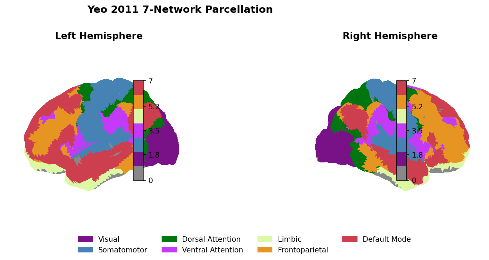
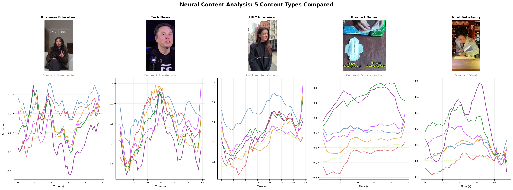
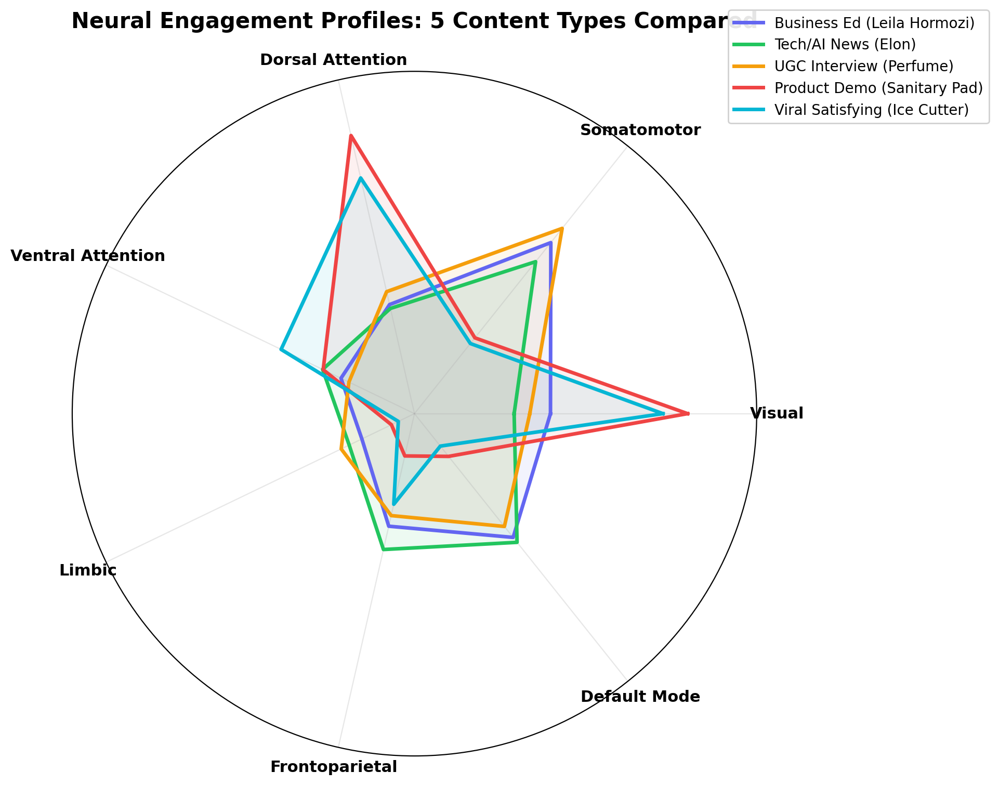
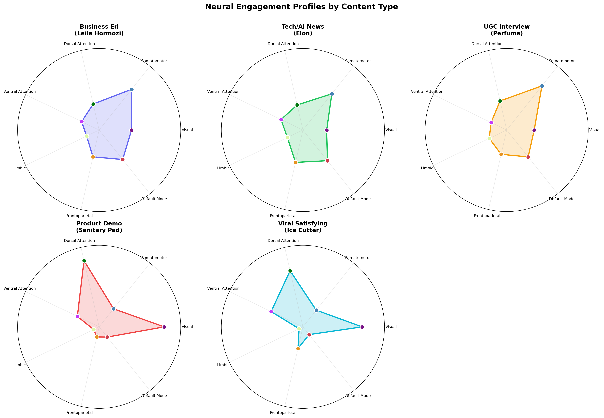
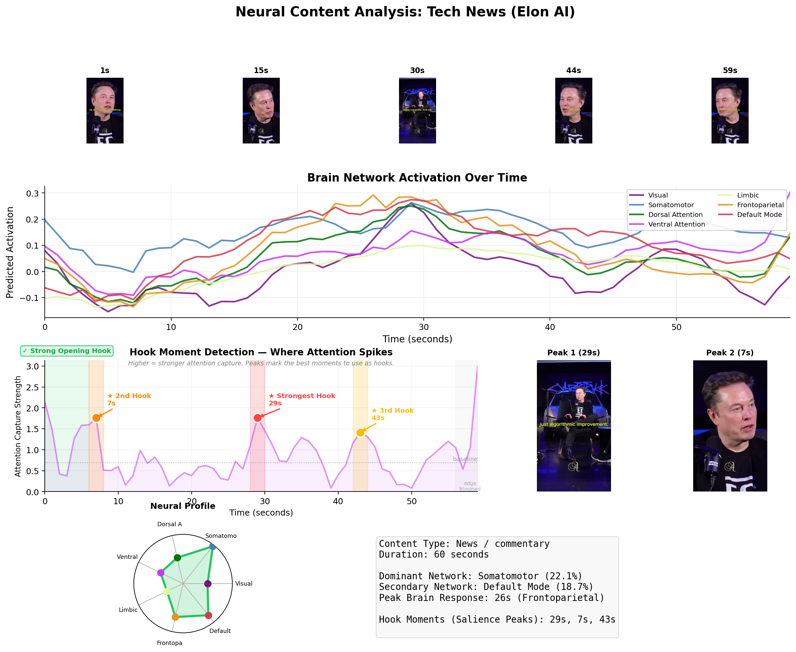
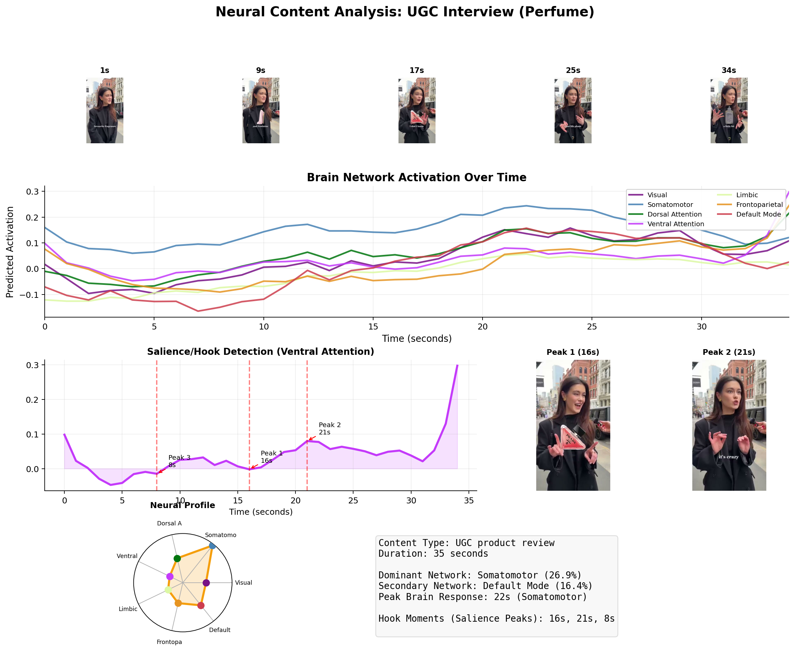
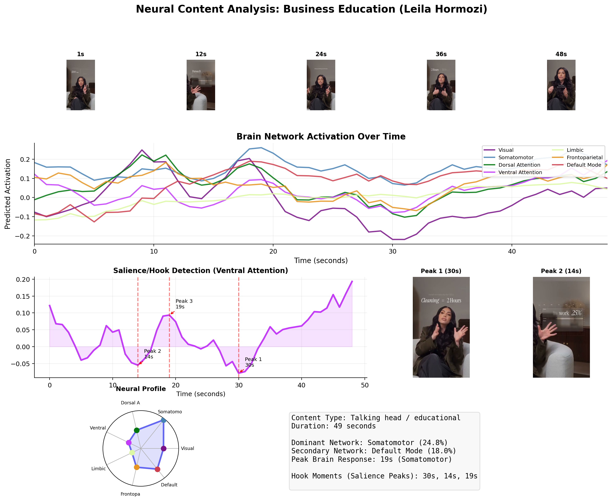
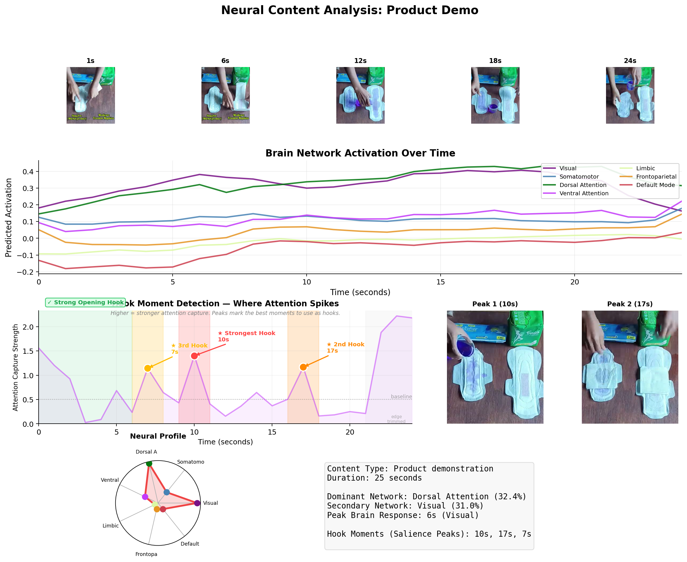
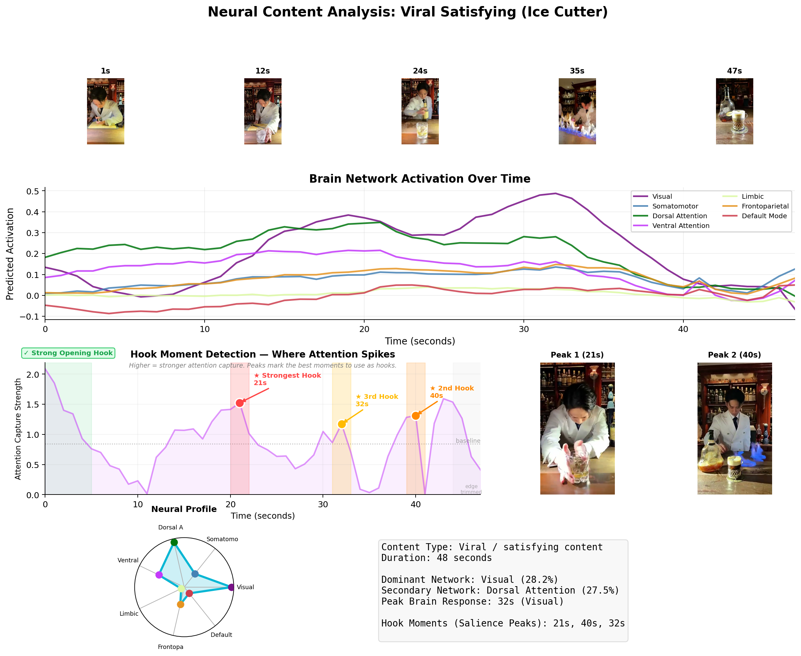
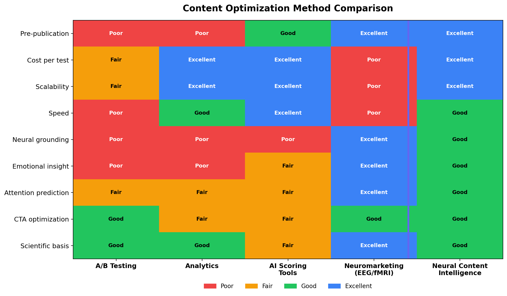

# Neural Content Intelligence: Using Brain Encoding Models to Predict Social Media Engagement Before Publication

**Josh W.**

Independent Researcher

---

## Abstract

The digital content industry relies on fundamentally reactive optimization: content is published, audience behavior is measured, and creators iterate. Traditional neuromarketing offers predictive neural measures but at prohibitive cost ($15,000-$150,000 per study), small sample sizes, and timescales incompatible with modern content workflows. We introduce Neural Content Intelligence (NCI), a framework that uses TRIBE v2, a tri-modal brain encoding foundation model trained on over 1,000 hours of fMRI data, to predict how the human brain would respond to video content entirely in silico. By mapping predicted voxelwise activations onto the Yeo 7-network brain parcellation, NCI translates raw neural predictions into seven interpretable cognitive engagement signals: visual salience, embodied response, sustained attention, surprise detection, emotional resonance, decision readiness, and narrative engagement. We define five composite engagement metrics, Attention Retention Score, Emotional Impact Index, Hook Strength Score, CTA Activation Score, and Neural Engagement Score, and demonstrate the framework through proof-of-concept analyses of five diverse short-form video content types. Our results reveal that different content formats produce distinct and interpretable neural signatures, consistent with established neuroscience of attention, emotion, and decision-making. NCI occupies a unique position in the content optimization landscape: the only approach that evaluates video content itself (not metadata), before publication, at computational scale, with explanatory power grounded in neuroscience. We discuss limitations, validation requirements, and applications for content creators and marketing teams.

**Keywords:** brain encoding models, neuromarketing, content optimization, fMRI prediction, social media engagement, TRIBE v2, Yeo parcellation, attention networks

---

## 1. Introduction

### 1.1 The Content Optimization Problem

Modern content marketing operates in an environment of staggering volume and fierce competition. Over 500 hours of video are uploaded to YouTube every minute. TikTok processes millions of new videos daily. Instagram, LinkedIn, and emerging platforms add further volume. For marketers, growth teams, user-generated content (UGC) creators, and brand managers, the central challenge is not creating content, it is creating content that reliably captures and holds human attention.

The current optimization paradigm is fundamentally post-hoc. Content is created based on intuition, best practices, and historical performance data. It is then published, and platforms provide analytics revealing what happened: view duration, drop-off points, click-through rates, shares, and conversions. The creator or team then iterates. This cycle is slow, expensive in both time and opportunity cost, and built on the assumption that past audience behavior predicts future audience behavior. For novel content formats, new products, or untested creative approaches, historical data provides little guidance.

A/B testing partially addresses this by testing variations, but it still requires an audience segment to react, and it cannot evaluate content that has not yet been published. AI-based tools like vidIQ, TubeBuddy, and Spotter offer predictions based on metadata features, titles, thumbnails, tags, posting time, but they cannot evaluate the content itself: the visual, narrative, and emotional qualities that determine whether a viewer watches for two seconds or two minutes [20, 47, 48].

### 1.2 The Neuroscience Opportunity

Neuroscience offers a fundamentally different approach. Two decades of consumer neuroscience research have established that brain responses to media content predict real-world outcomes, often better than self-report measures [1, 8, 10, 21]. Functional MRI studies have shown that activation patterns in specific brain regions during ad viewing predict population-level market performance, recall, and purchase behavior. EEG studies have demonstrated that neural engagement metrics correlate with content memorability and sharing intent [24, 25, 27, 28].

However, traditional neuromarketing requires bringing subjects into a laboratory, placing them in an fMRI scanner or fitting them with EEG caps, showing them the content, and analyzing the resulting brain data. This process costs tens of thousands of dollars, takes weeks, and cannot scale to the pace of modern content creation where a team might produce dozens of assets per week [13, 14, 60, 61].

### 1.3 The Brain Encoding Model Breakthrough

Brain encoding models change this equation entirely. These computational models, trained on massive datasets of brain imaging paired with natural stimuli, learn to predict how the human brain would respond to arbitrary new stimuli. The critical advance: once trained, these models can predict brain responses to content that no human has ever seen, running entirely on standard computing hardware [2, 4, 6, 9].

TRIBE v2 (Task-driven Recurrent Inference-Based Encoding model, version 2) represents the current state of the art in this space. Developed at Meta and trained on over 1,000 hours of fMRI recordings from approximately 720 participants, TRIBE v2 achieves unprecedented accuracy in predicting voxel-level brain responses to natural video, approaching the noise ceiling of the underlying fMRI data in many brain regions [2, 9].

This paper proposes and demonstrates a framework, Neural Content Intelligence (NCI), for applying TRIBE v2's predicted brain responses to content optimization. By mapping predicted neural activation onto the Yeo 7-network brain parcellation [3, 5], a standard neuroscience atlas that divides the brain into functionally distinct networks, we translate raw predicted brain activity into interpretable engagement metrics that correspond to specific cognitive processes relevant to content effectiveness.

---

## 2. Related Work

### 2.1 Neural Prediction of Market Outcomes

The scientific foundation for using neural measures to predict real-world outcomes is now substantial. Falk, Berkman, and Lieberman [1, 8, 21, 22] introduced the concept of "neural focus groups," demonstrating that fMRI responses from 30-31 smokers viewing anti-smoking campaigns predicted subsequent increases in calls to a quitline across a population of roughly 400,000 recipients, whereas both participants' and experts' self-reported effectiveness rankings did not. Later work from Falk's group generalized this pattern, showing that aggregated medial prefrontal cortex (mPFC) activity during message exposure can predict both individual behavior change and population-level campaign response, with models combining neural and self-report data explaining up to approximately 65% of the variance in outcomes [23].

Dmochowski, Parra, and colleagues [10, 24, 25] extended neural prediction to entertainment outcomes using intersubject correlation (ISC) of EEG and fMRI during naturalistic viewing. In a 2014 study, EEG from 16 participants watching television content predicted large-audience preferences, matching up to approximately 90% of population rankings for Super Bowl ads. Neural reliability also correlated with social media engagement metrics, suggesting that synchrony captures shared attention and emotional resonance that scales to market-level behavior.

Knutson and colleagues [11, 29] demonstrated that anticipatory affective activity in reward and risk-related brain regions foreshadows financial market dynamics. Nucleus accumbens activity predicted short-term stock price direction, while anterior insula activity predicted impending price inflections, neural signals that forecasted aggregate price changes even when prior price movements and participants' choices did not. Related work by Camerer and Montague [30, 31, 32] used multi-subject fMRI during experimental markets to show that aggregate nucleus accumbens activity tracked bubble growth and predicted future price changes.

Across these lines of research, several robust patterns emerge. Small neural samples (dozens of people) can forecast large-scale behaviors (hundreds of thousands of viewers, national ad ratings, or market prices) with meaningful accuracy, sometimes outperforming self-report, expert judgment, and conventional indicators [1, 8, 10, 11, 30, 31]. Predictive regions are task-specific but conceptually coherent: mPFC for self-relevance and value integration in persuasive messaging; nucleus accumbens and anterior insula for anticipatory reward and risk; intersubject synchrony for shared attention and engagement with media [24, 32].

### 2.2 Neuromarketing Industry Landscape

The commercial neuromarketing industry has grown alongside the academic research. Companies such as Neuro-Insight (using Steady-State Topography, a proprietary EEG variant), Nielsen Consumer Neuroscience (combining EEG, eye tracking, and facial coding), iMotions (providing a multi-sensor biometric research platform), and Neurons Inc (offering AI-assisted neuromarketing analysis) have built businesses around measuring brain and physiological responses to advertising and content [13, 14, 17, 60].

However, the industry faces persistent challenges. Neuromarketing studies using fMRI historically involve scanner rental rates of $500-$1,000 per hour, though some providers report delivering full fMRI-based advertising tests for under 5,000 euros when smaller samples are sufficient [60]. EEG-based approaches are generally cheaper, with commercial headsets ranging from a few hundred to tens of thousands of dollars, but total costs depend heavily on software, analysis tools, and expertise [61, 62, 63].

Systematic reviews of EEG-based neuromarketing highlight major methodological challenges: small and homogeneous samples (often under 30 participants), noise, manual feature engineering, and limited ecological validity [13, 14, 26, 61]. Many studies may be directionally correct only about 20% of the time when taken in isolation [16]. Ethnographic work on neuromarketing consultancies documents significant secrecy around algorithms, analytic methods, and interpretive frameworks, creating tensions between the promise of neural insight and the reality of opaque commercial practice [17, 64].

### 2.3 Brain Encoding Models

Brain encoding models represent a parallel track of neuroscience research that has converged with the neuromarketing opportunity. The modern encoding model framework was formalized by Naselaris et al. (2011) [R2], who described the voxelwise encoding approach: for each voxel in a brain scan, build a model that predicts that voxel's activation level from features of the stimulus. Early models used hand-crafted features, Gabor wavelets for visual texture, motion energy for temporal dynamics, achieving modest but significant predictions primarily in early visual cortex [R3, R12].

The field transformed with the application of deep neural networks as feature extractors. Researchers discovered that the internal representations learned by convolutional neural networks trained on ImageNet classification bore a remarkable resemblance to the representational hierarchy of the primate visual system [R10, R11, R16]. Lower CNN layers predicted early visual cortex responses; higher layers predicted higher visual areas. This finding opened the door to using powerful pre-trained neural networks as the basis for brain encoding models.

### 2.4 Current Content Optimization Tools

Contemporary content optimization tools fall broadly into three clusters [15, 18, 19, 20, 46, 47, 48, 49, 50, 51, 52]:

**Conversion-rate optimization (CRO) and experimentation platforms** such as Optimizely, VWO, and Hotjar support A/B and multivariate tests, heatmaps, and funnel analysis. These require large samples and extended run times to reach statistical significance and can only compare a small number of creative variants at a time.

**Creator-centric video/SEO tools** like TubeBuddy and vidIQ help YouTube creators with keyword research, metadata optimization, and thumbnail testing [20, 47, 48]. These are strongly coupled to YouTube SEO with reported weaknesses including shallow or noisy keyword metrics and limited guidance on what to create rather than how to tag it [53, 54].

**AI-based language and creative optimization tools** (e.g., Persado, Phrasee) generate and test variations of subject lines and ad copy, typically focused on enterprise email and web channels [49, 50, 51, 52]. These are expensive, sales-led enterprise products with limited transparency and inaccessible to small creators.

None of these mainstream tools directly incorporate brain networks, neural synchrony, or validated psychological frameworks into their objective functions [15, 55, 56, 57, 58, 59]. In effect, current content optimization ecosystems treat human cognition as a black box, searching over creatives in behavior space instead of leveraging the increasingly well-understood neural and psychological structure of engagement.

### 2.5 Theoretical Frameworks

Several established theoretical frameworks from psychology and marketing provide grounding for a neural engagement model.

The **Elaboration Likelihood Model (ELM)**, developed by Petty and Cacioppo [55, 65, 66, 67], distinguishes a central route (high elaboration, careful scrutiny of arguments) from a peripheral route (low elaboration, reliance on heuristics). Neurally, central-route processing aligns with sustained activation in frontoparietal control networks, while peripheral cues engage salience, limbic, and reward systems [38, 39].

**System 1/System 2** dual-process cognition, as described by Kahneman [68, 69, 70, 71, 72], distinguishes fast, automatic cognition from slow, deliberate reasoning. This maps onto low-effort affective responses driven by salience, reward, and default-mode processes versus high-effort reflective processing involving frontoparietal control networks.

The **AIDA model** (Attention, Interest, Desire, Action) [73, 74, 75, 76, 77] describes stages in the buyer journey that can be mapped onto temporal patterns across Yeo networks: attention involves visual and dorsal/ventral attention activation; desire recruits limbic and reward regions; action involves frontoparietal control networks.

**Transportation Theory** [56, 57, 58, 59, 78], via Green and Brock's Transportation Imagery Model, posits that narrative persuasion works by "transporting" individuals into a story world. Narrative transportation is likely supported by coordinated activity in the default mode network (autobiographical and mentalizing processes), limbic regions, and attentional networks [7, 41, 79].

, 

## 3. Background

### 3.1 The Yeo 7-Network Parcellation

Published by Yeo et al. in 2011 [3, 5, 33], the 7-network brain parcellation was derived from resting-state functional connectivity data from 1,000 subjects, identifying seven large-scale brain networks that consistently emerge across individuals. These networks have become a standard reference atlas in modern neuroimaging research. The seven networks and their functional roles are:

1. **Visual Network.** Primary and extrastriate visual cortex. Processes visual features,edges, colors, motion, objects. Activation intensity reflects the visual richness and processing demand of content.

2. **Somatomotor Network.** Primary motor and somatosensory cortex. Processes bodily sensations and motor actions. Relevant for embodied cognition and mirror neuron-mediated responses to observed actions [12].

3. **Dorsal Attention Network (DAN).** Includes frontal eye fields and intraparietal sulcus. Mediates voluntary, sustained, top-down attention [34, 35, 36, 37]. Activation reflects deliberate attentional engagement with content.

4. **Ventral Attention (Salience) Network.** Includes temporoparietal junction and ventral frontal cortex. Detects salient, unexpected, or behaviorally relevant stimuli [34, 38, 39, 40]. Drives attentional reorienting,the neural "surprise" response. The anterior insula and dorsal anterior cingulate cortex form a salience network that switches between default, control, and other systems [42, 44].

5. **Limbic Network.** Includes orbitofrontal cortex and temporal pole. Processes emotional valence and reward-related information. Activation reflects emotional impact and affective engagement [3, 5, 12].

6. **Frontoparietal (Control) Network.** Includes dorsolateral prefrontal cortex and posterior parietal cortex. Supports executive function, working memory, and decision-making [5, 12, 38]. Activation reflects cognitive engagement and evaluative processing.

7. **Default Mode Network (DMN).** Includes medial prefrontal cortex, posterior cingulate, and angular gyrus [7, 41]. Active during self-referential thought, narrative comprehension, mentalizing, and future simulation. High DMN engagement during content viewing indicates narrative transportation and personal relevance.

*Figure A: The Yeo 2011 7-network parcellation mapped onto the fsaverage5 cortical surface. Each color represents a distinct functional brain network. TRIBE v2 predictions at each of the 20,484 cortical vertices are averaged within these networks to produce interpretable cognitive engagement signals.*

This mapping is consistent with classic attention-network work from Corbetta and Shulman [34, 35, 37, 43], who distinguish a dorsal frontoparietal network for goal-directed selection from a ventral frontoparietal system specialized for detecting salient or unexpected stimuli and acting as a "circuit breaker" to reorient attention. Key researchers connecting these network-level descriptions to engagement constructs include Menon and Uddin [38, 42] on the salience network, Buckner, Andrews-Hanna, and Schacter [41] on the DMN, and constructionist approaches emphasizing flexible recombination of networks [12].

### 3.2 TRIBE v2 Architecture and Capabilities

TRIBE v2 is Meta's predictive foundation model trained to infer human fMRI activity from tri-modal inputs: video, audio, and language [2, 4, 6, 9, 45]. It builds on earlier brain encoding models that typically used linear regression or modest neural networks to map visual or auditory features to voxelwise BOLD responses. The TRIBE v2 training corpus aggregates more than 1,000 hours of fMRI recordings from approximately 720 participants watching and listening to naturalistic stimuli, spanning multiple datasets including the Human Connectome Project (HCP) 7T and Natural Scenes Dataset [2, 9].

Architecturally, TRIBE v2 leverages modern multimodal transformers that take synchronized video frames, audio waveforms, and text as input and output predicted high-resolution voxelwise activation patterns across cortex and subcortex. Compared to its predecessor, TRIBE v2 expands spatial resolution from on the order of 1,000 coarse regions to over 70,000 voxels,a roughly 70-fold increase in granularity [4, 6, 9].

Three key performance properties characterize TRIBE v2:

- **High group-level encoding accuracy.** On the HCP 7T dataset, TRIBE v2 reaches group correlation values (R_group) around 0.4 when predicting held-out subjects' responses, roughly double the median subject's group-predictivity in conventional encoding analyses [2, 9].
- **Zero-shot generalization.** An "unseen subject" layer allows the model to predict group-averaged responses for new individuals and tasks without fine-tuning, often matching or exceeding the predictive accuracy of single-subject recordings because the model effectively filters out individual noise [2, 4, 6, 9, 45].
- **Log-linear scaling.** Encoding accuracy improves approximately log-linearly with additional fMRI training data, with no clear plateau observed, suggesting that larger neuroimaging repositories could further boost performance [2, 9].

The critical insight for content optimization is that TRIBE v2 does not require an fMRI scanner at inference time. Once trained, the model takes video frames as input and produces predicted voxelwise brain activation maps as output. This transforms brain prediction from a laboratory procedure costing tens of thousands of dollars into a computational operation running on standard GPU hardware.

---

## 4. Methodology: The Neural Content Intelligence Framework

### 4.1 System Architecture

The NCI framework operates as a four-stage pipeline:

**Stage 1. Input Processing.** Short-form video content (MP4, MOV, or other standard formats) is ingested and preprocessed. Frames are extracted at a rate matched to TRIBE v2's temporal resolution (typically 1-2 Hz, matching the hemodynamic response timescale of fMRI). Frames are resized and normalized to match the model's expected input dimensions.

**Stage 2. Neural Prediction.** Preprocessed frames are passed through the TRIBE v2 model, which generates predicted voxelwise brain activation maps for each time point. The output is a matrix of shape (T x V), where T is the number of time points and V is the number of cortical voxels in the model's output space (approximately 20,484 vertices on the fsaverage5 surface).

**Stage 3. Network Parcellation.** Predicted voxelwise activations are aggregated using the Yeo 7-network atlas. For each time point, the mean predicted activation within each of the seven networks is computed, producing a (T x 7) matrix of network-level time courses. These time courses can be further decomposed into temporal statistics (mean, variance, peak, slope, onset latency).

**Stage 4. Engagement Scoring.** Network-level time courses are transformed into interpretable engagement metrics through defined formulas (Section 6). These metrics are presented to the user alongside the raw network time courses, enabling both high-level scoring and granular temporal analysis, for example, identifying the exact moment attention drops off.

### 4.2 Network-to-Engagement Mappings

The core interpretive framework maps each Yeo network to a specific aspect of content engagement:

| Yeo Network | Engagement Dimension | Interpretation |
|---|---|---|
| Visual | **Visual Salience** | How visually stimulating and processing-intensive the content is. High values indicate visually rich, complex scenes. |
| Somatomotor | **Embodied Response** | Degree to which content evokes physical/motor resonance. Relevant for content featuring physical actions, sports, cooking, dance. |
| Dorsal Attention | **Sustained Attention** | Degree of voluntary, focused attention the content demands and maintains. High values indicate the viewer is locked in, following a complex narrative or task. |
| Ventral Attention | **Surprise / Novelty** | Detection of salient, unexpected elements. High activation indicates moments of surprise, pattern breaks, or novel stimuli, critical for hooks and retention spikes. |
| Limbic | **Emotional Resonance** | Emotional engagement with the content. High activation indicates strong affective response. |
| Frontoparietal | **Decision Activation** | Evaluative and executive processing. High activation suggests the viewer is cognitively engaged in a decision-relevant way, weighing information, evaluating claims, considering action. |
| Default Mode | **Narrative Engagement** | Self-referential and narrative processing. High DMN activation during content viewing indicates narrative transportation, relating content to oneself, or simulating described scenarios. |

### 4.3 Temporal Analysis

A critical advantage of NCI over aggregate content scores is temporal resolution. The framework produces network activation time courses at approximately 1 Hz, enabling:

- **Hook analysis:** Characterizing the first 1-3 seconds of content in terms of which networks are activated and how quickly.
- **Drop-off prediction:** Identifying moments where attention network activation declines, predicting audience retention drop-off points.
- **Emotional arc mapping:** Tracking the emotional trajectory of content across its duration.
- **CTA timing optimization:** Identifying when frontoparietal (decision) activation is highest, suggesting optimal timing for calls to action.

This temporal granularity connects to the AIDA framework [73, 76]: attention and interest stages correspond to early visual, dorsal/ventral attention, and salience network activation; desire recruits limbic and reward regions; action involves frontoparietal control networks. NCI can define sequence-based features that track predicted transitions through these stages and correlate them with conversion outcomes.

---

## 5. Proposed Engagement Metrics

We define five computable engagement metrics derived from network-level activation time courses. Let $N_v(t)$, $N_d(t)$, $N_a(t)$, $N_l(t)$, $N_{dm}(t)$, $N_f(t)$, and $N_s(t)$ denote the predicted activation at time $t$ for the Visual, Dorsal Attention, Ventral Attention (salience), Limbic, Default Mode, Frontoparietal, and Somatomotor networks, respectively. Let $T$ denote total video duration in time steps.

### 5.1 Attention Retention Score (ARS)

Measures the content's ability to capture and sustain viewer attention across its duration.

$$ARS = \frac{1}{T} \sum_{t=1}^{T} \left( 0.5 \cdot \hat{N}_d(t) + 0.3 \cdot \hat{N}_a(t) + 0.2 \cdot \hat{N}_v(t) \right) \times \left(1 - \frac{\sigma_d}{2}\right)$$

Where $\hat{N}$ denotes z-scored (normalized) network activation and $\sigma_d$ is the standard deviation of the dorsal attention time course, penalizing high variance that indicates inconsistent attention. The weighting emphasizes sustained (dorsal) attention most heavily, followed by salience-driven capture (ventral) and baseline visual processing.

*Interpretation:* ARS ranges from 0 to 1 after min-max normalization against a reference corpus. Scores above 0.7 suggest content that will hold attention well. Scores below 0.4 suggest significant attention retention risk.

### 5.2 Emotional Impact Index (EII)

Measures the emotional resonance and affective depth of the content.

$$EII = \frac{1}{T} \sum_{t=1}^{T} \left( 0.6 \cdot \hat{N}_l(t) + 0.4 \cdot \hat{N}_{dm}(t) \right) + \lambda \cdot \max_{t}(\hat{N}_l(t))$$

Where $\lambda$ is a weighting factor (default 0.2) that rewards peak emotional moments. The inclusion of the Default Mode Network captures the narrative and self-referential processing that deepens emotional engagement beyond raw limbic activation.

*Interpretation:* High EII indicates content that generates strong emotional engagement, associated with higher sharing rates and stronger brand/message recall [56, 57].

### 5.3 Hook Strength Score (HSS)

Measures the potency of the content's opening moments, critical for short-form video where the first 1-3 seconds determine whether the viewer scrolls past.

$$HSS = \frac{1}{T_h} \sum_{t=1}^{T_h} \left( 0.5 \cdot \hat{N}_a(t) + 0.3 \cdot \hat{N}_v(t) + 0.2 \cdot \hat{N}_l(t) \right)$$

Where $T_h$ is the hook window (default: first 3 seconds of content). The formula prioritizes ventral attention (surprise/salience), followed by visual processing intensity and emotional engagement in the opening seconds.

*Interpretation:* HSS above 0.7 suggests a strong hook likely to stop the scroll. HSS below 0.3 suggests the opening is unlikely to capture attention in a competitive feed environment.

### 5.4 CTA Activation Score (CAS)

Measures the degree to which the content activates decision-making and evaluative neural circuits, indicating readiness to respond to a call to action.

$$CAS = \max_{t \in [T_{cta}-w, T_{cta}+w]} \hat{N}_f(t) + 0.3 \cdot \hat{N}_f(T_{cta})$$

Where $T_{cta}$ is the intended CTA timing and $w$ is a window (default: 2 seconds). If no CTA timing is specified, CAS reports the maximum frontoparietal activation and its temporal location, suggesting optimal CTA placement.

*Interpretation:* CAS measures whether the content has primed the viewer for decision-making at the moment a CTA appears. High CAS at the intended CTA timing suggests the viewer is in a cognitive state conducive to conversion.

### 5.5 Neural Engagement Score (NES)

A composite score providing a single overall engagement prediction.

$$NES = w_1 \cdot ARS + w_2 \cdot EII + w_3 \cdot HSS + w_4 \cdot CAS$$

Default weights: $w_1 = 0.35$, $w_2 = 0.25$, $w_3 = 0.25$, $w_4 = 0.15$. Weights can be adjusted based on the content goal (e.g., brand awareness campaigns might increase $w_2$; direct-response campaigns might increase $w_4$).

*Interpretation:* NES provides a single 0-1 score summarizing predicted overall neural engagement. It is most useful for comparing content variants or ranking a batch of content assets.

---

## 6. Proof of Concept: Analyzing Real Short-Form Content

The digital advertising market exceeds $500 billion annually, yet the dominant content creation paradigm remains "spray and pray", produce content based on intuition, publish it, wait for analytics, and iterate. A/B testing improves on pure intuition but still requires publishing before evaluation. NCI offers something no existing tool provides: the ability to evaluate how a viewer's brain will respond to content *before* it reaches an audience. To demonstrate this capability on content that matters to marketers, we analyzed five real short-form videos representing the major content archetypes used across TikTok, Instagram Reels, YouTube Shorts, and paid social advertising.

### 6.1 Implementation and Dataset

We implemented the NCI pipeline with the following components:

- **TRIBE v2 Inference Engine.** The pre-trained TRIBE v2 model, loaded in PyTorch, performs voxelwise prediction from video frames. Inference runs on a single GPU (tested on NVIDIA GPUs with 12+ GB VRAM), processing a typical 30-60 second short-form video in under two minutes.
- **Yeo Parcellation Module.** The Yeo 7-network atlas aggregates predicted voxelwise activations into network-level signals. The atlas is applied in the same surface space (fsaverage5) used by TRIBE v2's output, with 20,484 cortical vertices assigned to their respective networks.
- **Visualization Dashboard.** A browser-based interface allows users to upload video files, run the inference pipeline, and view interactive visualizations including network time courses, salience peak detection, radar profiles, and cross-video comparison dashboards.

The five videos were selected to represent key content marketing archetypes that collectively span the strategic landscape of short-form content:

| # | Content Type | Video | Duration | Format Archetype |
|---|---|---|---|---|
| 1 | Business Education | Leila Hormozi | 49s | Talking head (educator/influencer) |
| 2 | Tech/AI News | Elon AI commentary | 60s | News commentary (information delivery) |
| 3 | UGC Product Review | Perfume street interview | 35s | User-generated content (authentic review) |
| 4 | Product Demo | Sanitary pad demonstration | 25s | Direct product demonstration (e-commerce) |
| 5 | Viral Satisfying | Japanese ice cutter | 48s | Visually driven viral content (organic reach) |

These archetypes were chosen because they require fundamentally different optimization strategies, a fact that is invisible to metadata-based tools but clearly visible in neural activation profiles. A talking-head educator and a product demonstration video may have similar titles, tags, and thumbnails, but they engage entirely different brain systems. NCI reveals these differences quantitatively.

### 6.2 Cross-Content Comparison

The most striking finding from the analysis is that different content types produce fundamentally different neural signatures, not minor variations, but qualitatively distinct engagement profiles. This has direct implications for content strategy: optimizing a talking-head video and optimizing a product demo require completely different approaches because they engage different brain systems.

*Figure 1: Cross-content comparison dashboard showing all five analyzed videos side by side. Each video's neural engagement profile, dominant networks, and salience peaks are displayed for direct comparison. The dashboard reveals at a glance that content types cluster into two broad categories: speech/narrative-driven (Videos 1-3) and visual/attention-driven (Videos 4-5).*

*Figure 2: Neural engagement profiles for all five content types overlaid on a single radar chart. Each line represents a different video's neural "fingerprint" across the 7 Yeo functional networks. The separation between talking-head content (Somatomotor + Default Mode dominance) and visual content (Visual + Dorsal Attention dominance) is immediately apparent. This is the core insight for content strategists: you cannot optimize all content the same way because different formats activate fundamentally different cognitive systems.*

*Figure 3: Individual neural engagement profiles for each video, revealing the distinct neural "fingerprint" of each content archetype. (1) Business education, Somatomotor + Default Mode; (2) Tech/AI News, Somatomotor + Default Mode + Frontoparietal; (3) UGC Perfume Interview, strong Somatomotor with elevated Limbic; (4) Product Demo, Visual + Dorsal Attention dominant; (5) Viral Ice Cutter, Visual + Dorsal Attention + high Ventral Attention.*

Full deep-analysis outputs for all five videos are available (Figures 4-6 present three in detail below; the complete analyses for the Elon AI and Perfume UGC videos are included as supplementary figures).

*Figure S1: Full NCI analysis of the Elon AI tech news commentary (60s). Similar Somatomotor + Default Mode profile to business education, but with notably elevated Frontoparietal activation (16%), indicating viewers are critically evaluating claims. The mid-video salience peak at 29s suggests a structural break point useful for CTA placement.*

*Figure S2: Full NCI analysis of the perfume UGC street interview (35s). Highest Somatomotor activation (27%) of all five videos, reflecting strong embodied/sensory processing. The opening frame triggers a salience peak (0s), confirming the hook works. Elevated Limbic activation (9%) compared to other talking-head content suggests emotional connection to the product.*

The radar overlay (Figure 2) reveals two distinct clusters. Videos 1-3 (talking-head formats) share a Somatomotor + Default Mode dominant profile, reflecting speech processing and narrative comprehension. Videos 4-5 (visual formats) share a Visual + Dorsal Attention dominant profile, reflecting sustained visual tracking. Within each cluster, meaningful differences emerge: the tech/AI news video adds Frontoparietal control (critical thinking), the UGC perfume review shows elevated Limbic engagement (emotional connection to the product), and the viral ice cutter video shows the highest Ventral Attention of any video (the "satisfying" surprise signature).

### 6.3 Deep Analysis: Talking-Head Content (Leila Hormozi: Business Education)

The Leila Hormozi video (49 seconds, talking-head format delivering business advice) represents the dominant content format on platforms like YouTube, LinkedIn, and Instagram for educators, coaches, and thought leaders.

**Neural profile:**

| Network | Activation | Interpretation |
|---|---|---|
| Visual | 15% | Low --- minimal visual complexity; the frame is a person talking |
| Somatomotor | **25%** | **Dominant** --- speech processing, vocal delivery, facial expression tracking |
| Dorsal Attention | 13% | Moderate --- viewer is following the argument |
| Ventral Attention | 9% | Low --- few surprise elements |
| Limbic | 7% | Low --- educational, not emotional content |
| Frontoparietal | 13% | Moderate --- some evaluative processing of the advice |
| Default Mode | **18%** | **Co-dominant** --- narrative engagement, self-referential processing |

**Salience peaks (hook moments):** 48s, 47s, 45s --- clustered at the end of the video.

*Figure 4: Full NCI analysis of Leila Hormozi business education video (49s). The network time course reveals sustained Somatomotor activation throughout (speech processing), with Default Mode co-activation indicating narrative engagement. Salience peaks cluster at the end, suggesting the closing argument contains the strongest attention-capture moments.*

**Business insight for talking-head creators:** The Somatomotor dominance reveals that for this content format, *voice quality, delivery cadence, and facial expressions are the primary engagement drivers*, not visual production value. Creators investing in expensive sets and lighting may be optimizing the wrong variable. The low Visual network activation (15%) confirms that viewers are not visually stimulated; they are processing the speaker's delivery and message. The high Default Mode activation (18%) indicates viewers are deeply processing the narrative content, relating the advice to their own situations, consistent with central-route persuasion processing as described by the ELM [55, 65]. For content strategists, this means talking-head content should be optimized for speaker delivery, argument structure, and personal relevance rather than visual complexity. The end-loaded salience peaks suggest that the strongest hook material is in the closing argument; a short-form editor might consider restructuring to lead with that moment.

### 6.4 Deep Analysis: Product Demonstration (Sanitary Pad)

The product demonstration video (25 seconds, showing a sanitary pad's absorption capability) represents the fastest-growing content format in e-commerce and direct-to-consumer marketing.

**Neural profile:**

| Network | Activation | Interpretation |
|---|---|---|
| Visual | **31%** | **Co-dominant** --- high visual processing demand from the demonstration |
| Somatomotor | 11% | Low --- no speech to process |
| Dorsal Attention | **32%** | **Dominant** --- sustained, goal-directed visual tracking |
| Ventral Attention | 12% | Moderate --- some surprise at demonstration results |
| Limbic | 3% | Very low --- no emotional narrative |
| Frontoparietal | 5% | Very low --- not evaluative; purely demonstrative |
| Default Mode | 6% | Very low --- no narrative or self-referential processing |

**Salience peaks (hook moments):** 24s, 17s, 21s --- distributed across the demonstration.

*Figure 5: Full NCI analysis of the product demonstration video (25s). The neural profile is radically different from talking-head content: Visual + Dorsal Attention account for 63% of total activation. The viewer's brain is locked into focused visual tracking of the product demonstration, with minimal narrative, emotional, or evaluative processing. This is pure "show don't tell" engagement.*

**Business insight for product marketers:** This video produces a completely different neural engagement strategy from talking-head content. Visual + Dorsal Attention dominance (63% combined) means viewers are *locked into focused visual tracking* of the product demonstration. The very low Limbic (3%), Default Mode (6%), and Frontoparietal (5%) activation means this content works through direct visual proof rather than emotional narrative or cognitive persuasion. This is the neural signature of "show don't tell" content. For e-commerce marketers, this profile validates the product demo format for items where visual proof is persuasive (absorption, strength, before/after transformations). However, the very low Frontoparietal activation suggests that viewers are not in a decision-making cognitive state, they are watching, not evaluating. This means CTA placement requires careful timing: the brand may need to add a brief verbal or text prompt after the visual demonstration to shift the viewer from passive observation (Dorsal Attention) to active evaluation (Frontoparietal) before presenting the purchase CTA.

### 6.5 Deep Analysis: Viral Satisfying Content (Japanese Ice Cutter)

The Japanese ice cutter video (48 seconds, showing the mesmerizing process of hand-cutting ice blocks) represents the "satisfying" content genre that drives massive organic reach on TikTok and Instagram.

**Neural profile:**

| Network | Activation | Interpretation |
|---|---|---|
| Visual | **28%** | **Co-dominant** --- strong visual processing |
| Somatomotor | 10% | Low --- minimal speech or motor content |
| Dorsal Attention | **27%** | **Co-dominant** --- sustained visual tracking |
| Ventral Attention | **17%** | **Highest of all 5 videos** --- the "satisfying" signature |
| Limbic | 2% | Very low --- not emotionally driven |
| Frontoparietal | 11% | Low-moderate --- some evaluative engagement |
| Default Mode | 5% | Very low --- no narrative processing |

**Salience peaks (hook moments):** 21s, 19s, 14s --- clustered in the middle of the video, not the opening.

*Figure 6: Full NCI analysis of the viral Japanese ice cutter video (48s). The highest Ventral Attention activation (17%) of any video in the analysis reveals the neural basis of "satisfying" content: repeated surprise/salience peaks that create an addictive watch-through quality. Hook moments cluster in the middle (14-21s), not the opening, suggesting the content builds anticipation rather than front-loading its strongest moments.*

**Business insight for viral/organic content creators:** The Ventral Attention activation (17%) is the *highest of all five videos* and reveals the neural mechanism behind "satisfying" content's addictive quality. Ventral Attention is the brain's surprise/salience detection system, it fires when something unexpected or particularly salient occurs. The combination of strong Visual processing, sustained Dorsal Attention, and repeated Ventral Attention peaks creates a neurally compelling viewing loop: the viewer is visually engaged, attentionally locked in, and repeatedly surprised. The near-absence of Limbic (2%) and Default Mode (5%) activation is equally revealing, this content does not work through emotional connection or narrative transportation. It is *purely perceptual engagement*. For content strategists, this means "satisfying" content optimization should focus entirely on visual rhythm, timing of reveals, and the frequency and intensity of surprise moments. The mid-video clustering of salience peaks (14-21s) rather than front-loading suggests that this content format builds anticipation, creating an escalating sense of satisfaction. A creator editing this type of content should ensure the visual payoff moments are properly spaced to maintain the salience-peak rhythm.

### 6.6 Comparative Insights for Content Strategy

Table 2 summarizes the neural profiles and strategic implications of all five videos.

| Video | Duration | Dominant Networks | Hook Moments | Optimization Target | Content Strategy |
|---|---|---|---|---|---|
| **Leila Hormozi** (Business Ed.) | 49s | Somatomotor 25% + Default Mode 18% | 48s, 47s, 45s (end-loaded) | Speaker delivery, argument structure, personal relevance | Optimize voice, cadence, facial expression; lead with strongest argument |
| **Elon AI** (Tech News) | 60s | Somatomotor 22% + Default Mode 19% + Frontoparietal 16% | 59s, 58s, 29s (end + mid) | Information density, argument quality, critical engagement | Leverage high Frontoparietal for CTA placement; the 29s mid-video peak suggests a structural break point |
| **Perfume UGC** (Product Review) | 35s | Somatomotor 27% + Default Mode 16% | 34s, 33s, 0s (end + opening) | Embodied/sensory experience, authentic delivery | Highest Somatomotor = strongest embodied response; opening hook works (0s peak); optimize for sensory language |
| **Sanitary Pad** (Product Demo) | 25s | Dorsal Attention 32% + Visual 31% | 24s, 17s, 21s (distributed) | Visual clarity, demonstration pacing, proof moments | Pure "show don't tell"; add verbal/text CTA bridge after visual proof |
| **Ice Cutter** (Viral Satisfying) | 48s | Visual 28% + Dorsal Attention 27% + Ventral Attention 17% | 21s, 19s, 14s (mid-video) | Visual rhythm, surprise timing, reveal pacing | Optimize salience-peak frequency; content builds anticipation, don't front-load |

*Table 2: Neural engagement profiles and strategic implications for five short-form content archetypes. Each content type engages fundamentally different brain systems, requiring different optimization strategies.*

Several cross-cutting insights emerge from this comparative analysis:

**1. Content format determines neural engagement strategy.** The most important finding is that talking-head and visual content engage *qualitatively different* brain systems. This is not a matter of degree, it is a categorical difference. Somatomotor + Default Mode dominance (talking heads) versus Visual + Dorsal Attention dominance (demonstrations/viral) represents two fundamentally different ways content can hold a viewer. Metadata-based optimization tools cannot detect this distinction. NCI can.

**2. Hook timing varies by content type.** The opening-second hook dogma ("you must capture attention in the first second") does not apply uniformly across content types. The UGC perfume review shows a salience peak at 0s (the hook works), but the viral ice cutter's strongest moments are at 14-21s (mid-video). The business education and tech news videos peak at the end. Different formats have different temporal engagement signatures, and NCI reveals where each format's strongest moments actually are.

**3. The "satisfying" content signature is neurally identifiable.** The ice cutter's uniquely high Ventral Attention activation (17% versus 8-12% for other videos) provides a quantitative neural fingerprint for "satisfying" viral content. Content creators aiming for organic virality can now evaluate whether their content achieves this signature before publishing.

**4. CTA readiness varies dramatically.** The tech/AI news video's elevated Frontoparietal activation (16%) creates natural windows for call-to-action placement, the viewer is already in an evaluative cognitive state. In contrast, the product demonstration (Frontoparietal 5%) and viral content (Frontoparietal 11%) leave viewers in a passive observation state that may require a deliberate cognitive shift before a CTA will be effective. This insight alone could significantly improve conversion rates for content marketers who currently place CTAs based on timing conventions rather than neural readiness.

**5. NCI provides a new pre-publication tool for the content creator's toolkit.** Alongside platform analytics (post-publication measurement), A/B testing (post-publication comparison), and metadata optimization (pre-publication surface features), NCI adds a fundamentally new capability: pre-publication evaluation of the content itself, the visual, narrative, and cognitive experience it creates. For the $500B+ digital advertising market, where marginal improvements in content effectiveness translate to significant ROI gains, the ability to neurally profile content before committing ad spend represents a meaningful strategic advantage.

---

## 7. Comparison with Existing Methods

Table 1 provides a systematic comparison of NCI with existing content optimization approaches across ten dimensions.

| Dimension | A/B Testing | Platform Analytics | AI Scoring (vidIQ, etc.) | Neuromarketing (EEG/fMRI) | Neural Content Intelligence |
|---|---|---|---|---|---|
| **Timing** | Post-publication | Post-publication | Pre-pub (metadata only) | Pre-publication | Pre-publication |
| **What it evaluates** | Audience behavior | Audience behavior | Metadata features | Brain responses (live) | Predicted brain responses (in silico) |
| **Content understanding** | None (black box) | None (black box) | Surface features | Deep (neural) | Deep (predicted neural) |
| **Cost per evaluation** | Ad spend + time | Free (post-pub) | $10-50/mo subscription | $15,000-$150,000/study | Compute cost (~$0.10--$1.00/video) |
| **Turnaround time** | Days to weeks | Real-time (post-pub) | Seconds | Days to weeks | Minutes |
| **Requires audience** | Yes | Yes | No | Yes (20-40 subjects) | No |
| **Explains WHY** | No | Limited (drop-off curves) | No | Yes (brain regions) | Yes (brain networks) |
| **Scalable** | Limited | N/A | Yes | No | Yes |
| **Evaluates video content** | Indirectly | Indirectly | No (metadata only) | Yes | Yes |
| **Scientific basis** | Statistics | Descriptive analytics | ML on historical data | Neuroscience (direct) | Neuroscience (computational) |

*Table 1: Comparison of content optimization approaches across ten dimensions.*

*Figure 7: Content Optimization Method Comparison. Color-coded matrix comparing five approaches across key dimensions. Green indicates strengths, yellow indicates moderate capabilities, and red indicates weaknesses. The Neural Content Intelligence column shows the unique combination of pre-publication capability, scalability, and neural grounding.*

The key differentiator of NCI is that it is the only approach that can evaluate video content itself (not just metadata), before publication (not requiring an audience), at scale (not requiring physical subjects), with explanatory power (why something works or does not, not just whether it does). This combination positions NCI as complementary to existing tools rather than a replacement: NCI provides the "why" and pre-publication prediction; platform analytics provide the "what happened" validation.

---

## 8. Applications

### 8.1 Pre-Publication Content Scoring

The most straightforward application is scoring content before it goes live. A marketing team producing 20 video assets per week can run all of them through the NCI pipeline and rank them by NES, identifying which are most likely to drive engagement. Resources, paid promotion budget, posting to primary versus secondary accounts, featured placement, can be allocated to the highest-scoring content.

This is particularly valuable for UGC programs where brands receive submissions from creators and must select which to feature. Instead of relying solely on subjective editorial judgment, NCI provides an objective neural engagement baseline.

### 8.2 Hook Optimization

For short-form video (TikTok, Reels, Shorts), the first 1-3 seconds determine whether the viewer continues watching or scrolls past. NCI's temporal resolution allows creators to evaluate multiple opening sequences and compare their Hook Strength Scores. A creator might film the same content with three different opening shots and select the one that produces the highest ventral attention activation in the critical first seconds.

Content editors can also use the ventral attention time course from longer content to identify the single most attention-grabbing moment and move it to the opening frame, a common editing technique that NCI can now inform with neural data rather than intuition.

### 8.3 CTA Timing Optimization

For content with a conversion goal (product sales, email signups, link clicks), the timing of the call to action matters. Placing a CTA when the viewer's frontoparietal network is least active means they are in a passive cognitive state, less likely to take action. NCI can identify moments of peak frontoparietal activation, when the viewer is most cognitively engaged and decision-ready, and recommend CTA placement at those moments.

### 8.4 Content Format Comparison

Different content formats activate different neural profiles, as demonstrated in our five-video analysis. NCI enables evidence-based format selection by predicting the neural engagement profile of each format for specific content topics. A brand might discover that their product explanations perform better in talking-head format (high frontoparietal activation leading to better CTA response) while their brand awareness content performs better as cinematic B-roll (high limbic and visual activation driving emotional recall).

### 8.5 Competitive Content Analysis

NCI can analyze competitors' content to understand their neural engagement profiles. A brand can benchmark their content's neural engagement scores against top-performing competitor content to identify gaps. Analysis might reveal that a competitor's consistently viral content has an emotional impact signature (high EII) that the brand's content lacks, pointing to a strategic direction.

---

## 9. Limitations and Future Work

### 9.1 Fundamental Limitations

**Encoding model accuracy is not perfect.** While TRIBE v2 achieves state-of-the-art brain prediction, it does not perfectly replicate the brain's response to every stimulus. Prediction accuracy varies across brain regions, with visual areas predicted most accurately and some higher-order regions less so [2, 9]. The metrics derived from imperfect predictions carry that uncertainty forward.

**Population-level predictions, not individual.** Brain encoding models are trained on data from a limited number of subjects and predict an "average" brain response. Individual differences in content preferences, cultural background, age, and cognitive style are not captured [13, 14, 26, 61]. This limitation is shared by all neuromarketing approaches using small samples [16] but is particularly relevant when the predictions are applied to diverse global audiences.

**No validation against engagement metrics.** The most critical limitation is that this proof of concept has not been validated against real-world social media engagement data. The mapping from network activations to engagement predictions is theoretically grounded but empirically unproven. Validation studies correlating NCI scores with actual view counts, watch time, shares, and conversions are essential and represent the immediate next step. Following Falk, Knutson, and others [1, 8, 11, 23], validation should focus on out-of-sample prediction: training models on a subset of content and testing on held-out items.

**Audio is not modeled in the current implementation.** Although TRIBE v2 supports tri-modal prediction including audio, our current proof-of-concept implementation processes only visual input. Audio, music, voiceover, sound effects, is a critical component of content effectiveness but is not currently included in the prediction pipeline. This represents a significant gap, as research has demonstrated that audio and visual information are integrated in the brain and jointly determine engagement.

**Training data bias.** The brain data used to train encoding models comes from subjects watching specific types of natural video content in a controlled laboratory setting. The model's predictions may be less accurate for content types poorly represented in the training data (e.g., highly stylized graphics, text-heavy slides, screen recordings). Additionally, training samples are drawn primarily from WEIRD (Western, educated, industrialized, rich, democratic) populations, limiting confidence in cross-cultural generalization [13, 14, 26, 61].

### 9.2 Ethical Considerations

The ability to predict brain responses computationally raises ethical questions that the field must address proactively [17, 64]:

- **Manipulation versus optimization.** There is a meaningful difference between optimizing content to be more engaging (helping viewers find content they enjoy) and manipulating neural responses to override cognitive control. The framework should be used for the former.
- **Transparency.** Content scored or optimized using neural prediction methods should ideally be disclosed as such. The NCI framework's use of well-documented open models and interpretable network-level outputs represents an improvement over opaque commercial neuromarketing practices [17].
- **Consent and data provenance.** The brain data used to train encoding models was collected with informed consent from research participants. Ensuring that the use of derived models for commercial applications is consistent with original consent agreements is essential.

### 9.3 Future Work

**Empirical validation.** The immediate priority is conducting controlled studies that correlate NCI predictions with real-world engagement metrics across diverse content types and platforms. Field experiments, randomly assigning traffic between creatives ranked by the neural model and those selected by baseline heuristics, would provide causal evidence of predictive value [15, 18, 46].

**Audio integration.** Extending the pipeline to include auditory features from TRIBE v2's full tri-modal capability, predicting activation in auditory cortex and multimodal integration areas, to capture the full sensory experience of video content.

**Audience segmentation.** Developing encoding models trained on subject subgroups (by age, gender, culture, or psychographic profile) to enable audience-specific predictions.

**Real-time editing integration.** Building NCI into video editing workflows (Premiere Pro, DaVinci Resolve, CapCut) as a plugin that provides neural engagement feedback as content is being edited.

**Larger-scale benchmarking.** Running NCI analysis on thousands of public social media videos with known performance metrics to establish normative score distributions and prediction accuracy baselines. Neural features can be compared against, and combined with, traditional features (metadata, historical CTR, textual embeddings) to quantify incremental predictive value [27, 28].

**Robustness and fairness.** Evaluating performance across demographic segments and cultures to mitigate the risk that neural predictions encode biases or only generalize to narrow populations [13, 14, 26, 61]. Providing transparent model documentation describing training data, neural feature extraction, outcome labels, and known limitations [17].

---

## 10. Conclusion

Neural Content Intelligence represents a paradigm shift in how we approach content optimization. Rather than asking audiences what they think (surveys), measuring what they do (analytics), or predicting from surface features (AI scoring), NCI asks a more fundamental question: how does the human brain respond to this content?

By leveraging TRIBE v2's ability to predict brain responses computationally, combined with the Yeo 7-network parcellation's ability to translate those predictions into interpretable cognitive dimensions, we can, for the first time, provide neuroscience-grounded content evaluation at the speed and scale required by modern content creation workflows.

Our proof-of-concept analysis of five diverse content types demonstrates that the framework produces interpretable and differentiated neural engagement profiles. Talking-head business content activates speech processing and narrative circuits; product demonstrations engage visual tracking and sustained attention systems; viral satisfying content drives perceptual salience with surprise peaks. These distinctions align with established neuroscience of attention [34, 35], emotion [7, 41], and decision-making [38, 39], and map onto validated psychological frameworks including the ELM [55], System 1/System 2 processing [68], AIDA [73, 76], and Transportation Theory [56, 57].

The framework is not a replacement for existing optimization methods. It is a complementary signal that adds a dimension no other tool provides: the predicted neural experience of viewing the content. When combined with traditional analytics, audience research, and creative intuition, NCI has the potential to meaningfully improve content effectiveness across industries, from social media marketing to education, entertainment, and public health communication.

The critical next step is empirical validation: establishing the quantitative relationship between predicted neural engagement and real-world outcomes. The existing neuromarketing literature, where small neural samples consistently predict population-level behaviors [1, 8, 10, 11, 30, 31], provides strong reason to expect that computationally predicted neural responses will carry similar predictive value. If that relationship proves robust, the vision of neurally informed content creation at scale becomes achievable.

---

## References

[1] Falk, E.B., Berkman, E.T., & Lieberman, M.D. (2012). From neural responses to population behavior: Neural focus group predicts population-level media effects. *Psychological Science*, 23(5), 439-445. https://pmc.ncbi.nlm.nih.gov/articles/PMC3725133/

[2] Meta AI. (2026). Introducing TRIBE v2: A Predictive Foundation Model Trained to Predict Brain Responses. https://ai.meta.com/blog/tribe-v2-brain-predictive-foundation-model/

[3] Yeo, B.T., Krienen, F.M., Sepulcre, J., et al. (2011). The organization of the human cerebral cortex estimated by intrinsic functional connectivity. *Journal of Neurophysiology*, 106(3), 1125-1165. DOI: 10.1152/jn.00338.2011

[4] The Source Code. (2026). Meta TRIBE v2 Brain AI Model. *LinkedIn*. https://www.linkedin.com/posts/thesource-code_meta-tribe-v2-brain-ai-model-neuromarketing-activity-7444082747557531648-eFvh

[5] Yeo, B.T., et al. (2011). Yeo 2011 fcMRI Clustering. *CBIG GitHub Repository*. https://github.com/ThomasYeoLab/CBIG/

[6] Meta AI. (2026). TRIBE v2 Release Discussion. *Reddit r/singularity*. https://www.reddit.com/r/singularity/comments/1s4bsse/

[7] Buckner, R.L., Andrews-Hanna, J.R., & Schacter, D.L. Default Mode Network. *FMRIB, University of Oxford*. https://www.fmrib.ox.ac.uk/primers/rest_primer/

[8] Falk, E.B., et al. Neural Focus Group Predicts Population-Level Media Effects. *PMC*. https://pmc.ncbi.nlm.nih.gov/articles/PMC3725133/

[9] Meta AI. (2026). TRIBE v2: A Predictive Foundation Model. *Meta AI Blog*. https://ai.meta.com/blog/tribe-v2-brain-predictive-foundation-model/

[10] Dmochowski, J.P., Bezdek, M.A., Abelson, B.P., Johnson, J.S., Schumacher, E.H., & Parra, L.C. (2014). Audience preferences are predicted by temporal reliability of neural processing. *Nature Communications*, 5, 4567. https://control.gatech.edu/wp-content/uploads/pubs/Dmochowski-et-al-2014-Nat-Comm.pdf

[11] Stallen, M., et al. (2021). Brain Activity Foreshadows Stock Price Dynamics. *Journal of Neuroscience*. https://pmc.ncbi.nlm.nih.gov/articles/PMC8026346/

[12] Barrett, L.F., et al. How The Brain Works: A Constructionist Approach to Mind-Brain Correspondence. *Brain First Institute*. https://www.brainfirstinstitute.com/blog/how-the-brain-works/

[13] Bazzani, A., et al. (2020). Is EEG Suitable for Marketing Research? A Systematic Review. *Frontiers in Neuroscience*. https://pmc.ncbi.nlm.nih.gov/articles/PMC7779633/

[14] Kumar, S., et al. (2024). A systematic review on EEG-based neuromarketing: recent trends and analysis. *Brain Informatics*. https://pmc.ncbi.nlm.nih.gov/articles/PMC11153447/

[15] Prose Media. (2026). How AI-driven ad creative testing uncovers winning campaigns. https://www.prosemedia.com/blog/how-ai-driven-ad-creative-testing/

[16] G&R LLC. Are Small Samples in Neuro Reliable? Some Thoughts about Power. https://www.gandrllc.com/neuromarketing/small-samples-neuro-reliable/

[17] Schneider, T., & Woolgar, S. (2019). Witness and Silence in Neuromarketing: Managing the Gap Between Science and Its Application. *Science, Technology, & Human Values*, 44(4). DOI: 10.1177/0162243919829222

[18] AI Digital. Native Video Advertising: Types, Examples, Best Practices. https://www.aidigital.com/blog/native-video-advertising

[19] CMS Crawler. (2024). 10 Best CRO Tools 2024: Boost Conversions. https://cmscrawler.com/blog/10-best-cro-tools-2024/

[20] OutlierKit. VidIQ vs TubeBuddy: Which is Best Choice for YouTube Growth. https://outlierkit.com/blog/vidiq-vs-tubebuddy

[21] UCLA Newsroom. Which ads are winners? Your brain knows better than you do. https://newsroom.ucla.edu/releases/which-ads-are-winners-your-brain-232443

[22] Falk, E.B., Berkman, E.T., & Lieberman, M.D. Neural Responses Predict Population Behavior. *Scribd*. https://www.scribd.com/document/76903120/

[23] Falk, E.B. (2016). Marketing Colloquia Presentation. *University of Pennsylvania, Wharton*. https://marketing.wharton.upenn.edu/wp-content/uploads/2016/10/

[24] Dmochowski, J.P., et al. (2014). Audience preferences are predicted by temporal reliability of neural processing. *Nature Communications*, 5, 4567.

[25] iMotions. Intersubject Correlation Notebook Release. https://imotions.com/blog/learning/product-news/intersubject-correlation-notebook-release/

[26] Alsharif, A.H., et al. A Review of EEG Applications in Neuromarketing. *ITS Surabaya*. https://scholar.its.ac.id/en/publications/

[27] Wang, J., et al. (2023). DeePay: deep learning decodes EEG to predict consumer's willingness to pay. *Scientific Reports*. https://pmc.ncbi.nlm.nih.gov/articles/PMC10277553/

[28] Boksem, M.A.S., et al. (2024). Do EEG Metrics Derived from Trailers Predict the Commercial Success of Movies? *Journal of Marketing Research*. DOI: 10.1177/00222437241309875

[29] Stallen, M., et al. (2021). Brain Activity Foreshadows Stock Price Dynamics. *Stanford University*. https://web.stanford.edu/~knutson/bad/stallen21.pdf

[30] Smith, A., et al. (2014). Irrational exuberance and neural crash warning signals during endogenous experimental market bubbles. *Proceedings of the National Academy of Sciences*. DOI: 10.1073/pnas.1318416111

[31] Smith, A., et al. (2014). Irrational exuberance and neural crash warning signals. *PNAS*. https://www.pnas.org/doi/pdf/10.1073/pnas.1318416111

[32] Neuroscience News. High Earners in a Stock Market Game Have Brain Patterns That Can Predict Market Bubbles. https://neurosciencenews.com/market-bubbles-stocks-neuroimaging-1162/

[33] Nilearn. Yeo 2011 atlas. https://nilearn.github.io/dev/modules/description/yeo_2011.html

[34] Corbetta, M., & Shulman, G.L. (2002). Control of goal-directed and stimulus-driven attention in the brain. *Nature Reviews Neuroscience*, 3(3), 201-215. https://www.semanticscholar.org/paper/53e66b6934516a9859573f4866f81f04bce977ae

[35] Corbetta, M., & Shulman, G.L. Orienting to the Environment: Separate Contributions of Dorsal and Ventral Frontoparietal Attention Systems. *Oxford Academic*. https://academic.oup.com/book/3395/chapter/144498741

[36] Wikipedia. Dorsal attention network. https://en.wikipedia.org/wiki/Dorsal_attention_network

[37] Corbetta, M., & Shulman, G.L. (2002). Control of goal-directed and stimulus-driven attention in the brain. *PubMed*. https://pubmed.ncbi.nlm.nih.gov/11994752/

[38] Menon, V., & Uddin, L.Q. (2010). Saliency, switching, attention and control: a network model of insula function. *Brain Structure and Function*. https://pmc.ncbi.nlm.nih.gov/articles/PMC2899886/

[39] Wikipedia. Salience network. https://en.wikipedia.org/wiki/Salience_network

[40] ScienceDirect. Salience Network overview. https://www.sciencedirect.com/topics/psychology/salience-network

[41] Default mode network electrophysiological dynamics. *Semantic Scholar*. https://pdfs.semanticscholar.org/6aa3/3e6cd0ecfa59a5fd9fd49ab85858315acea4.pdf

[42] Wiech, K., et al. (2019). Anterior Insula Integrates Information about Salience into Perceptual Decisions. *Journal of Neuroscience*. https://pmc.ncbi.nlm.nih.gov/articles/PMC6634837/

[43] Corbetta, M., & Shulman, G.L. (2002). Control of goal-directed and stimulus-driven attention in the brain. *PDF*. https://www.cnbc.cmu.edu/~tai/readings/nature/corbetta_shulman.pdf

[44] Chand, G.B., & Dhamala, M. (2016). The salience network dynamics in perceptual decision-making. *Neuroimage*. http://physics.gsu.edu/dhamala/publications/

[45] Jackson, M. (2026). Meta's AI Brain Model Revolutionizes Communication Research. *LinkedIn*. https://www.linkedin.com/posts/michele-jackson-138ba51a_introducing-tribe-v2/

[46] Smarter Ecommerce. The Ultimate Guide to AI Max for Google Search. https://smarter-ecommerce.com/blog/en/google-ads/the-ultimate-guide-to-ai-max-for-google-search/

[47] TubeBuddy. vidIQ vs TubeBuddy: Which is Best for You? https://www.tubebuddy.com/blog/vidiq-vs-tubebuddy/

[48] Linodash. VidIQ vs TubeBuddy: My Experience Using Both. https://linodash.com/vidiq-vs-tubebuddy/

[49] AskNeedle. (2026). The Top AI Tools for Ad Copy Generation: 12 Real Options. https://www.askneedle.com/blog/top-ai-tools-for-ad-copy-generation

[50] AI Flow Review. (2025). Persado AI Review. https://aiflowreview.com/persado-ai-review-2025/

[51] Gemoniq. (2026). 15 Best AI Marketing Tools (Tested & Reviewed). https://gemoniq.com/blog/best-ai-marketing-tools-2026/

[52] Persado. Persado Motivation AI Platform. https://www.persado.com

[53] TubeBuddy vs VidIQ (2025). YouTube video comparison. https://www.youtube.com/watch?v=caUPOR1nhIc

[54] Why TubeBuddy vs VidIQ Sucks in 2025. YouTube review. https://www.youtube.com/watch?v=0j1OJJ6HKVs

[55] Wikipedia. Elaboration likelihood model. https://en.wikipedia.org/wiki/Elaboration_likelihood_model

[56] Wikipedia. Transportation theory (psychology). https://en.wikipedia.org/wiki/Transportation_theory_(psychology)

[57] de Graaf, A., et al. (2020). Empowering Stories: Transportation into Narratives with Strong Protagonists. *PLoS ONE*. https://pmc.ncbi.nlm.nih.gov/articles/PMC6999344/

[58] Green, M.C., & Brock, T.C. (2000). The role of transportation in the persuasiveness of public narratives. *Journal of Personality and Social Psychology*. https://www.semanticscholar.org/paper/bc637900cf9d32410a0e0e7fd5fe675ad9626ea4

[59] Shen, F., et al. Transportation Theory Applied to Health and Risk Messaging. *Oxford Research Encyclopedia of Communication*. DOI: 10.1093/acrefore/9780190228613.001.0001

[60] NMSBA. Is fMRI Expensive? https://www.nmsba.com/neuromarketing-companies/neuromarketing-technologies-explained/what-is-fmri

[61] Brieflands. EEG in Branding Research: A Systematic Review. https://brieflands.com/journals/amhsr/articles/167635

[62] EMOTIV. The Best Neuromarketing EEG Equipment (Buyer's Guide). https://www.emotiv.com/blogs/news/the-best-neuromarketing-eeg-equipment-buyers-guide

[63] UNB Scholar. A Survey on Neuromarketing using EEG Signals. https://unbscholar.lib.unb.ca/bitstreams/69f1e049-e4ad-463b-8230-c63cb549eccf/download

[64] Criticism of Neuromarketing: Ethical Concerns and Limitations. https://www.praxis-psychologie-berlin.de/wikiblog-english/articles/criticism-of-neuromarketing/

[65] Petty, R.E., & Cacioppo, J.T. (1986). The Elaboration Likelihood Model of Persuasion. *Advances in Experimental Social Psychology*. https://richardepetty.com/wp-content/uploads/2019/01/1986-advances-pettycacioppo.pdf

[66] Elaboration likelihood model explained. https://everything.explained.today/Elaboration_likelihood_model/

[67] Verywell Mind. The Elaboration Likelihood Model of Persuasion Explained. https://www.verywellmind.com/the-elaboration-likelihood-model-of-persuasion-7724707

[68] Kahneman, D. (2011). *Thinking, Fast and Slow*. Farrar, Straus and Giroux.

[69] Farnam Street. Daniel Kahneman Explains The Machinery of Thought. https://fs.blog/daniel-kahneman-the-two-systems/

[70] Kahneman, D. Of 2 Minds: How Fast and Slow Thinking Shape Perception and Choice. http://faculty.fortlewis.edu/burke_b/CriticalThinking/Readings/

[71] The Decision Lab. System 1 and System 2 Thinking. https://thedecisionlab.com/reference-guide/philosophy/system-1-and-system-2-thinking

[72] Kahneman, D. Of 2 Minds: How Fast and Slow Thinking Shape Perception and Choice. *PDF*.

[73] Agile Brand Guide. AIDA - Attention/Awareness, Interest, Desire, Action. https://agilebrandguide.com/wiki/marketing-funnel/aida/

[74] SiteTuners. AIDA Model: Attention, Interest, Desire, Action. https://sitetuners.com/blog/aida-model/

[75] TechTarget. AIDA marketing model. https://www.techtarget.com/whatis/definition/AIDA-marketing-model

[76] Wikipedia. AIDA (marketing). https://en.wikipedia.org/wiki/AIDA_(marketing)

[77] Corporate Finance Institute. AIDA Model. https://corporatefinanceinstitute.com/resources/management/aida-model-marketing/

[78] Green, M.C., & Brock, T.C. (2000). The Role of Transportation in the Persuasiveness of Public Narratives. *Journal of Personality and Social Psychology*. http://www.communicationcache.com/uploads/

[79] Uddin, L.Q., et al. (2019). Towards a universal taxonomy of macro-scale functional human brain networks. *Brain Topography*. https://pmc.ncbi.nlm.nih.gov/articles/PMC7325607/

**Additional foundational references:**

[R1] Smidts, A. (2002). Kijken in het brein: Over de mogelijkheden van neuromarketing. *ERIM Inaugural Address*.

[R2] Naselaris, T., Kay, K.N., Nishimoto, S., & Gallant, J.L. (2011). Encoding and decoding in fMRI. *NeuroImage*, 56(2), 400--410.

[R3] Nishimoto, S., Vu, A.T., Naselaris, T., Benjamini, Y., Yu, B., & Gallant, J.L. (2011). Reconstructing visual experiences from brain activity evoked by natural movies. *Current Biology*, 21(19), 1641-1646.

[R4] Montague, R., McClure, S.M., Li, J., et al. (2004). Neural correlates of behavioral preference for culturally familiar drinks. *Neuron*, 44(2), 379-387.

[R5] Knutson, B., Rick, S., Wimmer, G.E., Prelec, D., & Loewenstein, G. (2007). Neural predictors of purchases. *Neuron*, 53(1), 147-156.

[R6] Hasson, U., Nir, Y., Levy, I., Fuhrmann, G., & Malach, R. (2004). Intersubject synchronization of cortical activity during natural vision. *Science*, 303(5664), 1634-1640.

[R7] Berger, J., & Milkman, K.L. (2012). What makes online content viral? *Journal of Marketing Research*, 49(2), 192-205.

[R8] Kay, K.N., Naselaris, T., Prenger, R.J., & Gallant, J.L. (2008). Identifying natural images from human brain activity. *Nature*, 452(7185), 352-355.

[R9] Fox, M.D., Corbetta, M., Snyder, A.Z., Vincent, J.L., & Raichle, M.E. (2006). Spontaneous neuronal activity distinguishes human dorsal and ventral attention systems. *Proceedings of the National Academy of Sciences*, 103(26), 10046-10051.

[R10] Khaligh-Razavi, S.M., & Kriegeskorte, N. (2014). Deep supervised, but not unsupervised, models may explain IT cortical representation. *PLoS Computational Biology*, 10(11), e1003915.

[R11] Yamins, D.L., Hong, H., Cadieu, C.F., Solomon, E.A., Seibert, D., & DiCarlo, J.J. (2014). Performance-optimized hierarchical models predict neural responses in higher visual cortex. *Proceedings of the National Academy of Sciences*, 111(23), 8619-8624.

[R12] Guclu, U., & van Gerven, M.A.J. (2015). Deep neural networks reveal a gradient in the complexity of neural representations across the ventral stream. *Journal of Neuroscience*, 35(27), 10005-10014.

---
